# Melting Snowman
Melting Snowman is a word-guessing game built with Python. It is a [Hangman](https://en.wikipedia.org/wiki/Hangman_(game)) type game, but instead of a hanged man, a snowman is drawn to show the progress of the game. 

The player can select the number of lives to set the difficulty for each game and suggest a letter at a time or a word containing the same number of letters as the word to be guessed. For each failed attempt, the player loses a life and the snowman starts to melt. The aim of the game is to guess the word correctly and save the snowman from melting! 

This game is designed for anyone above the age of 8 who would like to have fun playing a word-guessing game and is intended to help them learn some new words. The words used in the game are all winter-themed to suit the game and some are more challenging than others to make the gameplay more exciting. 

## Deployed Website
[Melting Snowman](https://the-melting-snowman-game.herokuapp.com/)

## Repository
https://github.com/ShizukaDonaghue/melting-snowman

## UX & Design

PLACE HOLDER Document the work undertaken to plan this project’s logic through flow charts or diagrams

## Features

## Python Libraries Used
### random:
* The random library was imported to choose a word randomly from words.py for each game. 
### os:
* The os library was imported to interact with the operating system to clear the terminal for new contents at different stages during the game. This provides a clearer and more pleasant experience for the player. 

## Technologies Used
### Main Language 
* [Python](https://en.wikipedia.org/wiki/Python_(programming_language)) was used to build the contents and structure of the game. 

### Tools used for Developing the Game
* [Gitpod](https://www.gitpod.io/) was used to create, edit and preview the codes during the development.
* [Git](https://git-scm.com/) was used for version control and tracked changes in the codes.
* [GitHub](https://github.com/) was used to store the repository and the codes.
* [Heroku](https://www.heroku.com) was used to deploy the application.

### Tool used for Validating the Codes
* [CI Python Linter](https://pep8ci.herokuapp.com/) was used to validate Python codes. 

### Other Online Resources used
* [Lucid](https://www.lucidchart.com/pages/) was used to generate the flow chart to plan the logic flow of the game.
* [ScreenToGif](https://www.screentogif.com/) was used to create the GIF image for the unresolved bug.
* [Compressor.io](https://compressor.io/) was used to compress the images used in the README file.
* [Grammarly](https://app.grammarly.com/) was used to remove grammatical and typographical errors in the game and README file.

## Testing
### Code Validation
The application has been fully validated to ensure there were no syntax errors. [CI Python Linter](https://pep8ci.herokuapp.com/) was used for the validation and no errors were ound.

  
Validation Results for run.py

  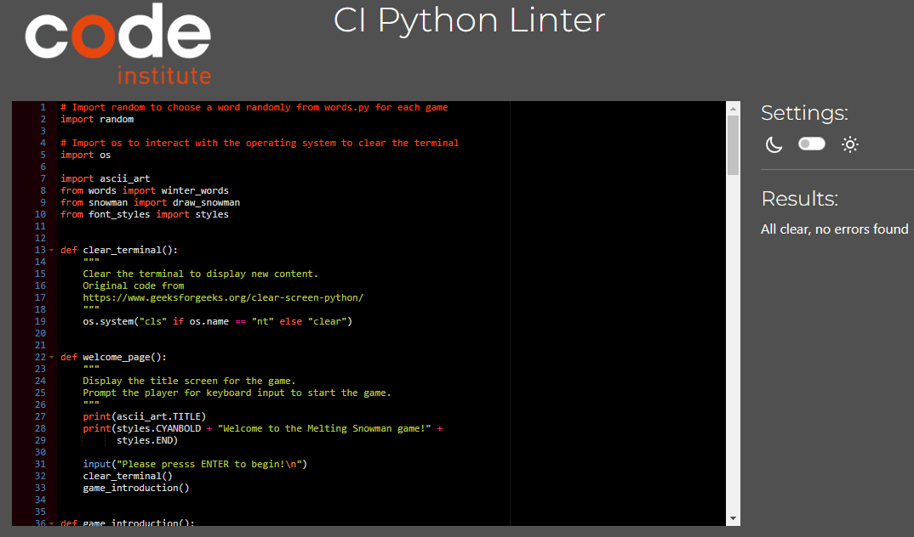

  
Validation Results for snowman.py

  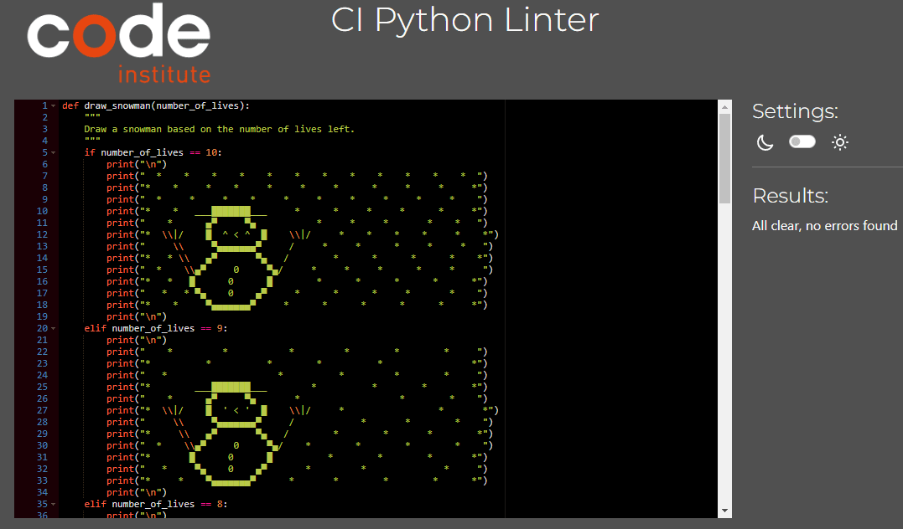

  
Validation Results for ascii_art.py

  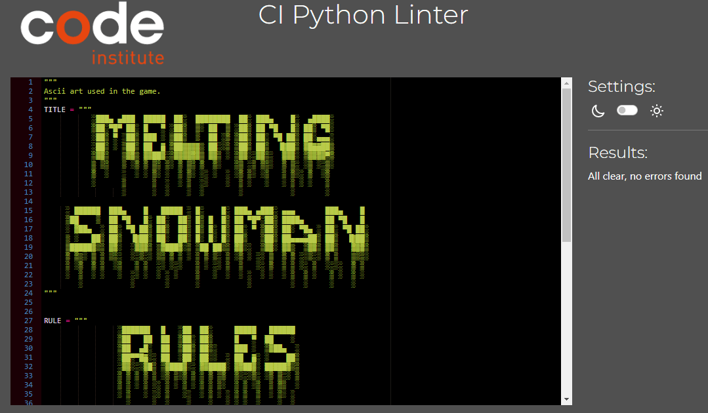

  
Validation Results for words.py

  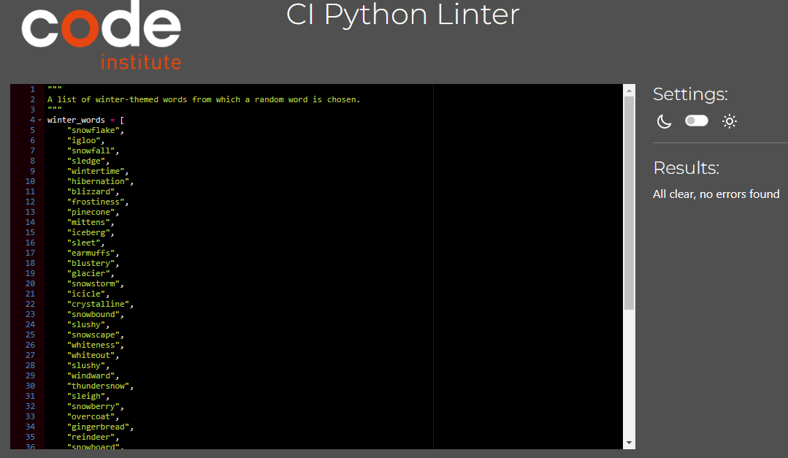

  
Validation Results for font_styles.py

  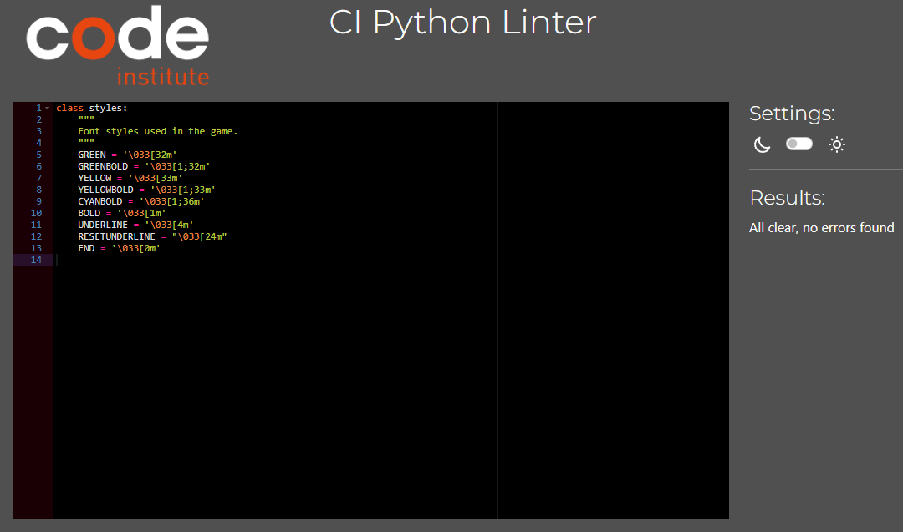

 

PLACE HOLDER FOR Implement basic manual testing procedures for code validation
Implement exception/error handling to optimise the user experience

PLACE HOLDER FOR Demonstrate, through screenshots, what the project outcomes are and how they have been met

### Resolved Bug
When font styles were added to `word_to_guess` variable, underscores for letters which were yet to be guessed did not print in the terminal of the deployed site. The issue was not seen in Gitpod. Various methods were tested and found that the underscores did not print in the deployed site if the font style was bold unless a background colour was added.

Image below showing how `word_to_guess` variable was printed in Gitpod. Underscores were printed in all font styles:  
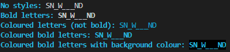

Image below showing how `word_to_guess` variable was printed in the terminal of the deployed site using the same codes (but a different word as the word was randomly chosen). Underscores did not print if the font style was bold, or if it is bold, a background colour needed to be added for the underscores to print in the deployed site:  
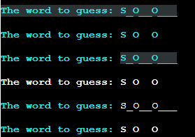

Since coloured letters are difficult to read without bold font style in the terminal of the deployed site, font styles have been removed from the variable so that the underscores are printed clearly in white for the letters which are yet to be guessed.

### Unresolved Bug
`os.system("cls" if os.name == "nt" else "clear")` is used to clear the terminal for new contents during the game. However, this only clears the contents that are visible in the terminal of the deployed site and if there are any contents above that, they can still be seen when scrolled up after the terminal has been cleared. This issue is not seen in Gitpod. 

GIF image below showing the visible area of the terminal in the deployed site is cleared for new contents (in this case, the "game over" message), but the contents above the visible area can still be seen when scrolled up. Please click on the image to watch the GIF as auto looping is turned off to reduce distraction.   
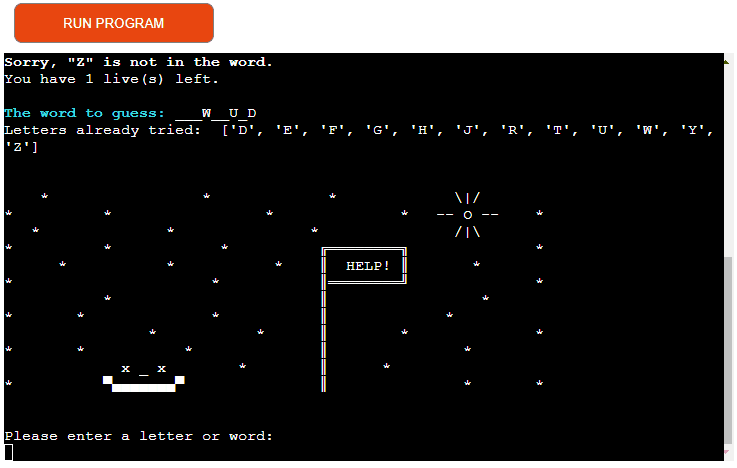
Methods tried to fix this issue:
1. `import subprocess` `subprocess.call('reset')`  
    This is to clear history and it works as expected in Gitpod, however, it did not even clear the terminal of the deployed site.
2. `print("\n" * 150)` 
    This does clear the terminal in Gitpod, but it stil did not clear the terminal of the deployed site. This method was also tried with `os.system("cls" if os.name == "nt" else "clear")`, however, it still did not clear the contents above the visible area of the terminal in the deployed site.

While this issue was not resolved, it should not affect the user experience during the game as the visible area of the terminal is cleared for new contents.

## Deployment
This application has been deployed using [Heroku](https://dashboard.heroku.com/).
The steps for deploying the application are as follows:

### Preparation:
1. In order for input methods to work correctly in the terminal of the deployed website, add a new line character `\n` at the end of each text inside the input method so that the input request will be displayed in the terminal.
2. If there are dependencies to run the application on [Heroku](https://dashboard.heroku.com/), run `pip3 freeze > requirements.txt` command which will update the "requirements.txt" file to include those dependencies. 
3. Push all updates to GitHub.

### Deploying the Application to Heroku:
1. Log into [Heroku](https://dashboard.heroku.com/) website.  
2. From the Dashboard page, select "New" and then "Create new app."  
    

      
Image for this step

      
    

3. Assign a name for the application, select the region and then select "Create app." 
    

      
Image for this step

      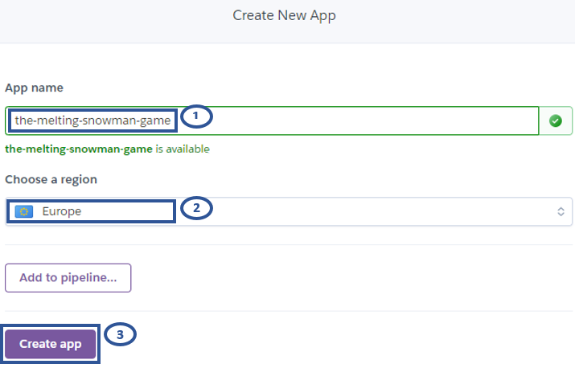
    
   

4. Once the application is created, from the submenu at the top, select "Settings" and then "Reveal config Vars" to set up config vars.  
    

      
Image for this step

      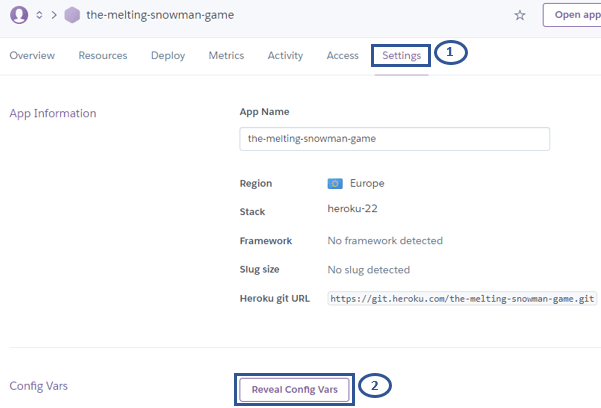
    
   

5. In the KEY input field, enter "PORT" all in capitals and enter "8000" for the VALUE input field and select "Add." If there are other config vars required to run the application, add those here. For this application, there is no other config var required.   
    

      
Image for this step

      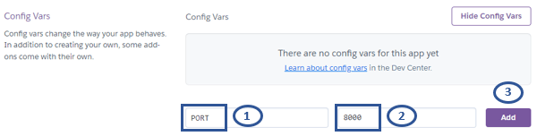
    
   

6. Scroll down to "Buildpacks" section and select "Add buildpack."  
    

      
Image for this step

      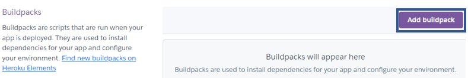
    
 

7. Add buildpacks required to run the application. For this application, "Python" and "Nodejs" are required.   
    

      
Image for this step

      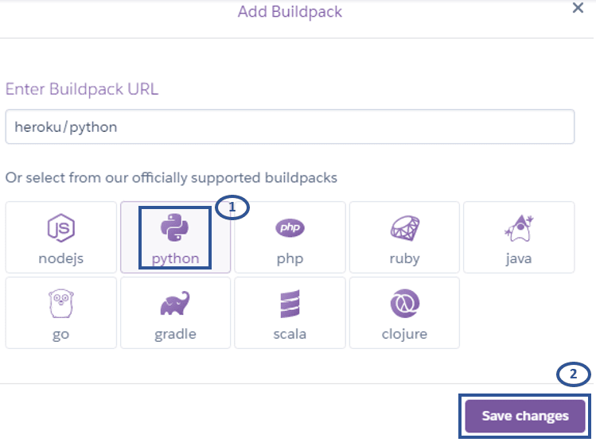
      
    
 

    The order of the bulidpacks is important. "Python" should be first with "Nodejs" second. If they are not in the correct order, click and drag to rearrange them.   
    

      
Image for this step

      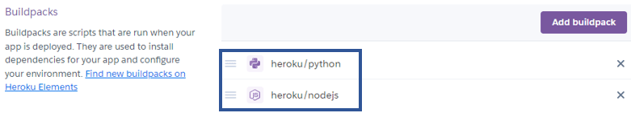
    
    
   
8. Select "Deploy" from the submenu at the top.    
    * Under the "Deployment method" section, select "GitHub" to connect to GitHub.  
    * Under the "Connect to GitHub" section, enter the name of the repository and select "Search."       
    * Once the repository is located, select "Connect" to connect the repository to the application within [Heroku](https://dashboard.heroku.com/).   
    

      
Image for this step

      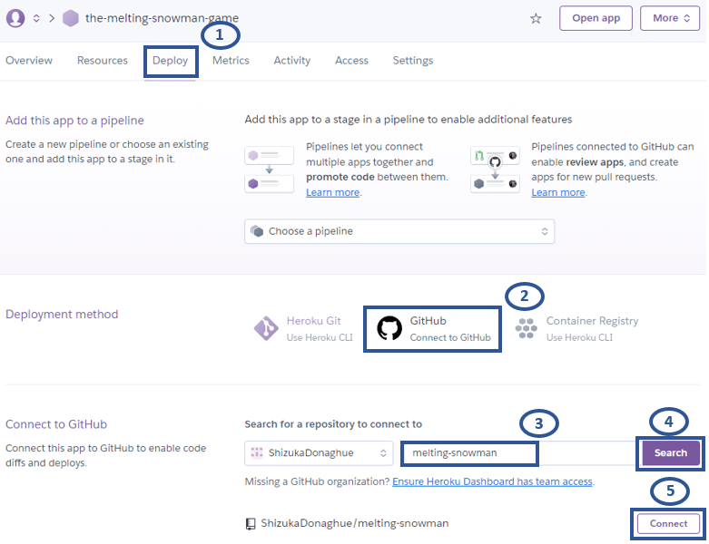
    
    

9. Select either "Enable Automatic Deploys" which will deploy a new version of the application every time changes are pushed to GitHub or opt for "Manual Deploy." For this application, "Automatic Deploys" was selected.  
    

      
Image for this step

      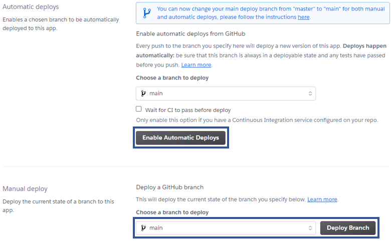
    
   

10. Once the application is deployed, scroll back to the top of the screen and select "Open app."   
    

      
Image for this step

      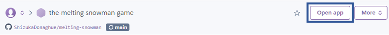
    
   

    If "Enable Automatic Deploys" has been selected, the application will be built and available after the next changes are pushed to GitHub. 

### Forking the Repository on GitHub:

  
Image for the following steps

  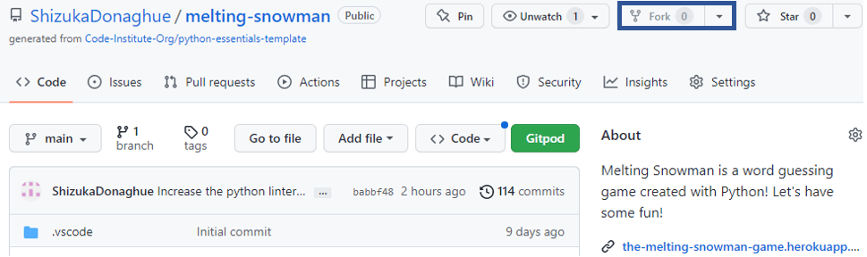

To make a copy or "fork" the original repository to view or make changes without affecting the original repository,  
1. Log into GitHub and locate the repository.
2. Select the "Fork" option at the top of the screen to create a copy of the repository.
3. This will create a copy of the repository in your GitHub account.

### Cloning the Repository on GitHub: 

  
Image for the following steps

  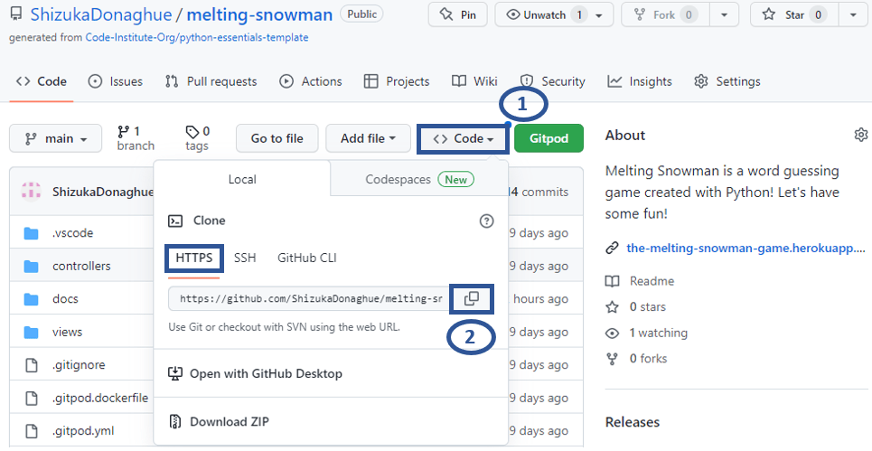

1. In the GitHub repository, select the "Code" button.
2. In the "Clone" box, under the "HTTPS" tab, select the clipboard icon to copy the URL.
3. In Gitpod, change the current working directory to the location you would like the cloned directory to be created.
4. Type "git clone" and then paste the URL copied from GitHub.
5. Press "Enter" and the local clone will be created.

## Credits
* ASCII art in ascii_art.py was created based on the font "bloody" from [TextKook](https://textkool.com/en/ascii-art-generator?hl=default&vl=default&font=Red%20Phoenix&text=Your%20text%20here%20) and modified by the developer to improve readability and suit the style of the game. The font is shaped to reflect melting snow. 
* Code to display correctly guessed letters is from [Kite](https://www.youtube.com/watch?v=m4nEnsavl6w).
* Code to clear the terminal is from [GeeksforGeeks](https://www.geeksforgeeks.org/clear-screen-python/).

## Acknowledgements

