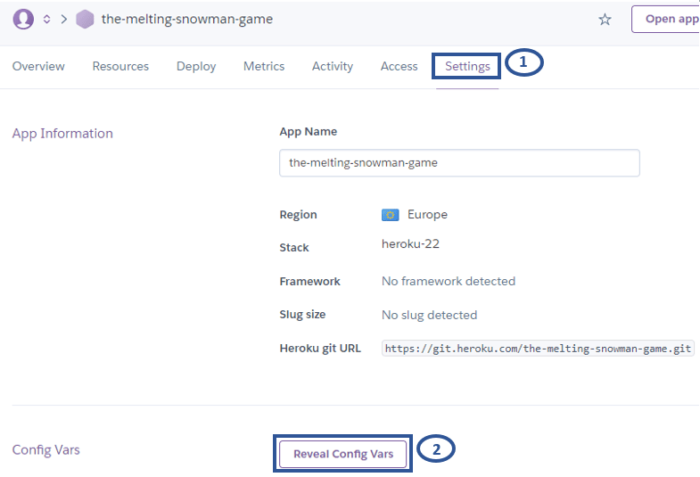

# Melting Snowman
## Deployed Website
[Melting Snowman](https://the-melting-snowman-game.herokuapp.com/)

## Repository
https://github.com/ShizukaDonaghue/melting-snowman

## UX & Design

## Features

## Technologies Used

## Testing

## Deployment
This application has been deployed using [Heroku](https://dashboard.heroku.com/).
The steps for deploying the application is as follows:

### Preparation:
1. In order for input method to work correctly in the terminal of the deployed website, add a new line character at the end of each text inside the input method so that the input request will be displayed in the terminal.
2. If there are dependencies to run the application on [Heroku](https://dashboard.heroku.com/), run "pip3 freeze > requirements.txt" command which will update "requirements.txt" file to include those dependencies. 
3. Push all updates to GitHub.

### Deployment to Heroku:
1. Log into [Heroku](https://dashboard.heroku.com/) website.  
2. From the Dashboard page, select "New" and then "Create new app."  
    
3. Assign a name for the application, select the region and then select "Create app.  
    
4. Once the application is created, from the submenu at the top, select "Settings" and then "Reveal config Vars" to set up config vars.  
    
5. In the KEY input field, enter "PORT" all in capitals and enter "8000" for the VALUE input field and select "Add." If there are other config vars required to run the application, add those here. For this application, there is no other config var required. 
    
6. Scroll down to "Buildpacks" section and select "Add buildpack."  
    
7. Add buildpacks required to run the application. For this application, "Python" and "Nodejs" are required.   
    
      
Add "Python" first and then "Nodejs" so that they are added in this order. If they are not in the correct order, click and drag to rearrange them.      
    
8. Select "Deploy" from the submenu at the top.    
Under "Deployment method" section, select "GitHub" to connect to GitHub.  
Under "Connect to GitHub" section, enter the name of the repository and select "Search."       
Once the respository is located, select "Connect" to connect the repository to the application within [Heroku](https://dashboard.heroku.com/).   
    
9. Select either "Enable Automatic Deploys" which will deploy a new version of the application every time changes are pushed to GitHub or opt for "Manual Deploy." For this application, "Automatic Deploys" was selected.
    
10. Once the application is deployed, scroll back to the top of the screen and select "Open app."   

If "Enable Automatic Deploys" has been selected, the application will be built and available after the next changes are pushed to GitHub. 

### Forking the Repository on GitHub
PLACE HOLDER

### Cloning the Repository on GitHub 
PLACE HOLDER

## Credits
* Code to display correctly guessed letters is from [Kite](https://www.youtube.com/watch?v=m4nEnsavl6w)
* Code to clear the terminal is from [GeeksforGeeks](https://www.geeksforgeeks.org/clear-screen-python/).

## Acknowledgements

