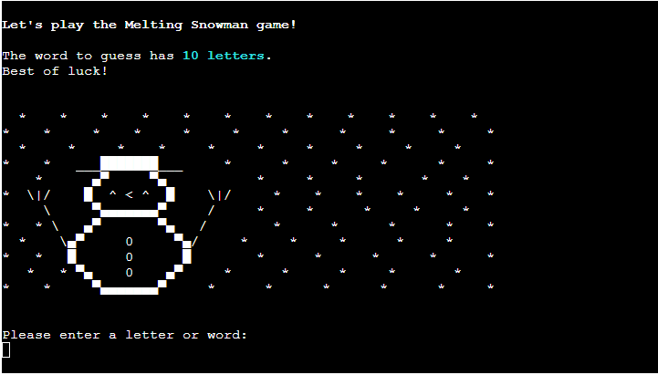
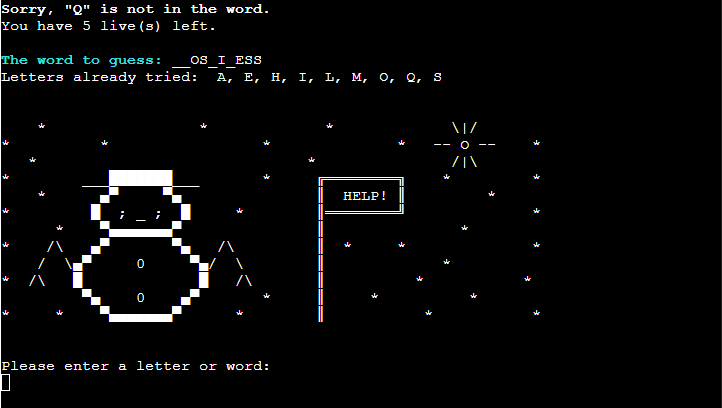
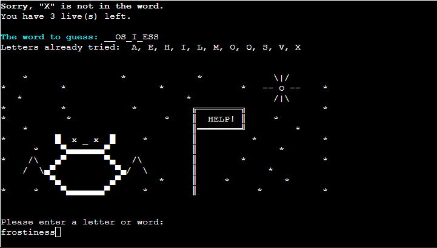
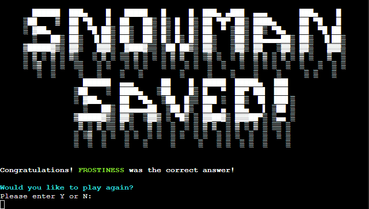
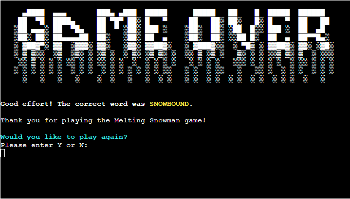

# Melting Snowman
Melting Snowman is a word-guessing game built with Python. It is a [Hangman](https://en.wikipedia.org/wiki/Hangman_(game)) type game, but instead of a hanged man, a snowman is drawn to show the progress of the game. 

The player can select the number of lives to set the difficulty for each game and suggest a letter at a time or a word containing the same number of letters as the word to be guessed. For each failed attempt, the player loses a life and the snowman starts to melt. The aim of the game is to guess the word correctly and save the snowman before he melts! 

This game is designed for anyone above the age of 8 who would like to have fun playing a word-guessing game and is intended to help them learn some new words. The words used in the game are all winter-themed to suit the game and some are more challenging than others to make the gameplay more exciting. 

## Live Website
[Melting Snowman](https://the-melting-snowman-game.herokuapp.com/)

## Repository
https://github.com/ShizukaDonaghue/melting-snowman

## UX & Design

### User Stories
As a user,  
* I would like to understand how to play the game with ease.
* I would like to be able to set the difficulty to suit my level.
* I would like feedback on each guess while playing the game.
* I would like to see an error message if my guess is invalid and understand why.
* I would like to see the letters already tried so that I would not suggest the same again.
* I would like to know the progress of the game while playing the game.
* I would like to have the option to play again or finish the game after each game. 

### Logic Flow
To plan the logical flow of the game, the following flow chart was generated detailing the individual steps. Each step is colour coded to distinguish different types of activities. 

## Features
### Existing Features
#### Welcome Screen
This is the Welcome Screen of the game. The title of the game is presented in ASCII art, which is shaped to resemble melting snow. The ASCII art was created based on the font "bloody" from [TextKook](https://textkool.com/en/ascii-art-generator?hl=default&vl=default&font=Red%20Phoenix&text=Your%20text%20here%20) and modified by the developer to improve readability and suit the theme of the game. In this screen, the player is prompted to press ENTER to initiate the game.

#### Rules Screen
Once the game is initiated, the player is brought to the Rules Screen, which introduces the game to the player. The aim and rules of the game are explained, including what inputs are accepted. At the bottom of the screen, the player is asked to select the number of lives to suit their level.  

#### Game Screen
Once the number of lives is set for the game, the word-guessing game begins.
A winter-themed word is randomly chosen for each game, and on the first screen (regardless of the number of lives selected), it lets the player know how many letters are in the word to be guessed. 

The snowman is drawn initially based on the number of lives selected. At the bottom of the screen, the player is asked to enter a letter or word to guess the word.   

Each input from the player is checked to see if it is in the word or is the actual word.  

If the input from the player is in the word, it gives feedback to the player and reveals the letter in the "The word to guess" field so that the player can see where the letter fits in the word and how many more letters are left to be guessed.   

If the input from the player is not in the word, it gives feedback to the player and lets the player know how many lives they have left. For each failed attempt, the player loses a life and the snowman starts to melt.  

From the second attempt, the letters which have already been tried are displayed to assist the player. 

The player can continue to suggest a letter at a time to guess the word, or they can decide to suggest the actual word until the word is guessed correctly or the player loses all of their lives. If a word containing the same number of letters as the word is suggested, it is checked to see whether it matches the word and if it does, the game finishes and if not, the player loses a life and the snowman melts even more. 

#### End of Game Screen
Once the game finishes, the player is brought to the End of Game Screen. 

If the word is guessed correctly, the "Snowman Saved!" message is displayed.   
ASCII art is used here again to add drama and it congratulates the player.

If the word is not guessed before the player loses all of their lives, the "Game Over" message is displayed and the word is revealed.  

 

In this final screen, the player is asked if they would like to play again or finish the game. If the player decides to play again, they are asked to select the number of lives to start another game. If the player decides to finish the game, they are brought to the Welcome Screen.

### Feature Left to Implement
The game currently does not have a leaderboard. A leaderboard containing the name of players who have saved the snowman with a minimum amount of lives lost would be a nice addition and would encourage the players to play more. 

## Python Libraries Used
### random:
* The random library was used to choose a word randomly from words.py for each game. 
### os:
* The os library was used to interact with the operating system to clear the terminal for new contents at different stages during the game. This provides a cleaner and more pleasant experience for the player. 

## Technologies Used
### Main Language 
* [Python](https://en.wikipedia.org/wiki/Python_(programming_language)) was used to build the contents and structure of the game. 

### Tools used for Developing the Game
* [Gitpod](https://www.gitpod.io/) was used to create, edit and preview the codes during the development.
* [Git](https://git-scm.com/) was used for version control and tracked changes in the codes.
* [GitHub](https://github.com/) was used to store the repository and the codes.
* [Heroku](https://www.heroku.com) was used to deploy the application.

### Tool used for Validating the Codes
* [CI Python Linter](https://pep8ci.herokuapp.com/) was used to validate Python codes. 

### Other Online Resources used
* [Figma](https://www.figma.com) was used to generate the flow chart to plan the logical flow of the game.
* [ScreenToGif](https://www.screentogif.com/) was used to create the GIF images.
* [Compressor.io](https://compressor.io/) was used to compress the images used in the README file.
* [Grammarly](https://app.grammarly.com/) was used to remove grammatical and typographical errors in the game and README file.

## Testing
For the full details of the testing executed, please see [TESTING.md](https://github.com/ShizukaDonaghue/melting-snowman/blob/main/TESTING.md). 

## Deployment
This application has been deployed using [Heroku](https://www.heroku.com/). The live link can be found here - [Melting Snowman](https://the-melting-snowman-game.herokuapp.com/).  

The steps for deploying the application are as follows:

### Preparation:
1. In order for input methods to work correctly in the terminal of the deployed website, add a new line character `\n` at the end of each text inside the input method so that the input request will be displayed in the terminal.
2. If there are dependencies to run the application on [Heroku](https://www.heroku.com/), run `pip3 freeze > requirements.txt` command which will update the "requirements.txt" file to include those dependencies. 
3. Push all updates to GitHub.

### Deploying the Application to Heroku:
1. Log into [Heroku](https://www.heroku.com/) website.
2. From the Dashboard page, select "New" and then "Create new app."
    

      
Image for this step

      
    

3. Assign a name for the application, select the region and then select "Create app."
    

      
Image for this step

      
    
   
4. Once the application is created, from the submenu at the top, select "Settings" and then "Reveal Config Vars" to set up config vars.
    

      
Image for this step

      
    
  
5. In the KEY input field, enter "PORT" all in capitals and enter "8000" for the VALUE input field and select "Add." If there are other config vars required to run the application, add those here. For this application, there is no other config var required.
    

      
Image for this step

      
    
   
6. Scroll down to the "Buildpacks" section and select "Add buildpack."
    

      
Image for this step

      
    
 
7. Add buildpacks required to run the application. For this application, "Python" and "Nodejs" are required.
    

      
Image for this step

      
      
    
 
    The order of the buildpacks is important. "Python" should be first and then "Nodejs." If they are not in the correct order, click and drag to change.
    

      
Image for this step

      
    
 
8. Select "Deploy" from the submenu at the top.
    * Under the "Deployment method" section, select "GitHub" to connect to GitHub.
    * Under the "Connect to GitHub" section, enter the name of the repository and select "Search."
    * Once the repository is located, select "Connect" to connect the repository to the application within [Heroku](https://www.heroku.com/).  
        

          
Image for this step

          
        
    
9. Select either "Enable Automatic Deploys" which will deploy a new version of the application every time changes are pushed to GitHub or opt for "Manual Deploy." For this application, "Automatic Deploys" was selected.
    

      
Image for this step

      
    

10. Once the application is deployed, scroll back to the top of the screen and select "Open app."  
    

      
Image for this step

      
    
   
    If "Enable Automatic Deploys" has been selected, the application will be built and available after the next changes are pushed to GitHub.

### Forking the Repository on GitHub:
To make a copy or "fork" the original repository to view or make changes without affecting the original repository,  
1. Log into GitHub and locate the repository.
2. Select the "Fork" option at the top of the screen to create a copy of the repository.
3. This will create a copy of the repository in your GitHub account.
    

      
Image for the above steps

      
    
  

### Cloning the Repository on GitHub: 
1. In the GitHub repository, select the "Code" button.
2. In the "Clone" box, under the "HTTPS" tab, select the clipboard icon to copy the URL.
3. In Gitpod, change the current working directory to the location you would like the cloned directory to be created.
4. Type "git clone" and then paste the URL copied from GitHub.
5. Press "Enter" and the local clone will be created.
    

      
Image for the above steps

      
    
  

## Credits
* ASCII art in ascii_art.py was created based on the font "bloody" from [TextKook](https://textkool.com/en/ascii-art-generator?hl=default&vl=default&font=Red%20Phoenix&text=Your%20text%20here%20) and modified by the developer to improve readability and suit the theme of the game. The font is shaped to resemble melting snow. 
* Code to display correctly guessed letters is from [Kite](https://www.youtube.com/watch?v=m4nEnsavl6w).
* Code to clear the terminal is from [GeeksforGeeks](https://www.geeksforgeeks.org/clear-screen-python/).

## Acknowledgements
The Melting Snowman game was created as a portfolio 3 project for the Full Stack Software Development course at [UCD Professional Academny](https://www.ucd.ie/professionalacademy/) and [Code Institute](https://codeinstitute.net/ie/).

I would like to thank my mentor, [Harry Dhillon](https://github.com/Harry-Leepz), for his valuable feedback, guidance and encouragement given throughout the project.

I would also like to thank [Simen Daehlin](https://github.com/Eventyret) at [Code Institute](https://codeinstitute.net/ie/) for his patience and time answering all the questions during the class and also in Slack.

