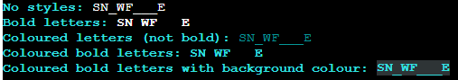
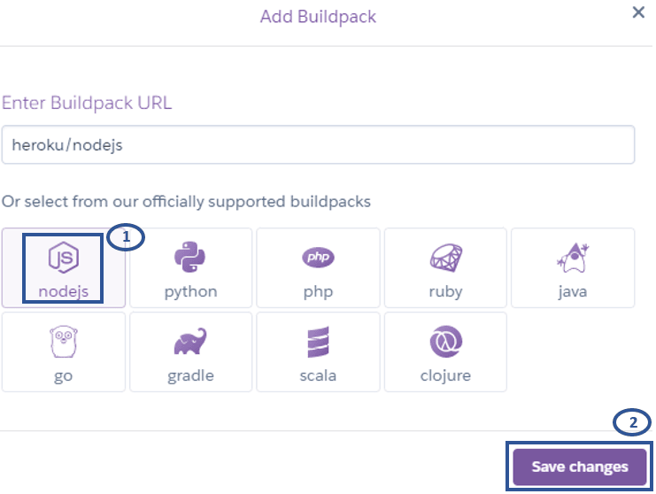

# Melting Snowman
Melting Snowman is a word guessing game built with Python. It is a [Hangman](https://en.wikipedia.org/wiki/Hangman_(game)) type game, but instead of a hanged man, a snowman is drawn to show the progress of the game. 

The player can select the number of lives to set the difficulty for each game and suggest a letter at a time or a word containing the same number of letters as the word to be guessed. For each failed attempt, the player loses a life and the snowman starts to melt. The aim of the game is to guess the word correctly and save the snowman from melting! 

This game is designed for anyone above the age of 8 who would like to have fun playing a word guessing game and is intented to help them learn some new words. The words used in the game are all winter-themed to suit the game and some are more challenging than others to add the excitement of the unknown. 

## Deployed Website
[Melting Snowman](https://the-melting-snowman-game.herokuapp.com/)

## Repository
https://github.com/ShizukaDonaghue/melting-snowman

## UX & Design

PLACE HOLDER Document the work undertaken to plan this project’s logic through flow charts or diagrams

Document the rationale as to why a particular library/libraries are necessary for the implementation of the project.

## Features

Libraries used?

## Technologies Used
Libraries used?
* [Python](https://en.wikipedia.org/wiki/Python_(programming_language))
* 
* [ScreenToGif](https://www.screentogif.com/) was used to create the GIF image for the unresolved bug.

## Testing

PLACE HOLDER FOR PEP3 linder results

PLACE HOLDER FOR Implement basic manual testing procedures for code validation
Implement exception/error handling to optimise the user experience

PLACE HOLDER FOR Demonstrate, through screenshots, what the project outcomes are and how they have been met

### Resolved Bug
When font styles were added to `word_to_guess` variable, underscores for letters which were yet to be guessed did not print in the terminal of the deployed site. The issue was not seen in gitpod. Various methods were tested and found that the underscores did not print in the deployed site if the font style was bold, unless a background colour was added.

Image showing how `word_to_guess` variable was printed in gitpod. Underscores were printed in all font styles:  

Image showing how `word_to_guess` variable was printed in the terminal of the deployed site using the same codes (but a different word as the word was randomly chosen). Underscores did not print if the font style was bold, or if it is bold, a background colour needed to be added for the underscores to print in the deployed site:  

Since coloured letters are difficult to read without bold font style in the terminal of the deployed site, font styles have been removed from the variable so that the underscores are printed clearly in white for the letters which are yet to be guessed.

### Unresolved Bug
`os.system("cls" if os.name == "nt" else "clear")` is used to clear the terminal for new contents during the game. However, this only cleares the contents that are visible in the termianl of the deployed site and if there are any contents above that, they can still be seen when scrolled up after the terminal has been cleared. This issue is not seen in gitpod. 

GIF image showing the visible area of the terminal in the deployed site is cleared for new contents (in this case, the "game over" message), but the contents above the visible area can still be seen when scrolled up. Please click on the image to watch the GIF as auto looping is turned off to reduce distraction.   
  

Various methods including the subprocess to clear the history were tested without any success. However, this issue should not affect the user experience during the game as the visible area of the terminal is cleared for new contents.

## Deployment
This application has been deployed using [Heroku](https://dashboard.heroku.com/).
The steps for deploying the application is as follows:

### Preparation:
1. In order for input method to work correctly in the terminal of the deployed website, add a new line character `\n` at the end of each text inside the input method so that the input request will be displayed in the terminal.
2. If there are dependencies to run the application on [Heroku](https://dashboard.heroku.com/), run `pip3 freeze > requirements.txt` command which will update "requirements.txt" file to include those dependencies. 
3. Push all updates to GitHub.

### Deployment to Heroku:
1. Log into [Heroku](https://dashboard.heroku.com/) website.  
2. From the Dashboard page, select "New" and then "Create new app."  
     

3. Assign a name for the application, select the region and then select "Create app."    
     

4. Once the application is created, from the submenu at the top, select "Settings" and then "Reveal config Vars" to set up config vars.  
     

5. In the KEY input field, enter "PORT" all in capitals and enter "8000" for the VALUE input field and select "Add." If there are other config vars required to run the application, add those here. For this application, there is no other config var required.   
     

6. Scroll down to "Buildpacks" section and select "Add buildpack."  
     

7. Add buildpacks required to run the application. For this application, "Python" and "Nodejs" are required.   
    
     

    The order of the bulidpacks is important. "Python" should be first with "Nodejs" second. If they are not in the correct order, click and drag to rearrange them.      
     

8. Select "Deploy" from the submenu at the top.    
    * Under "Deployment method" section, select "GitHub" to connect to GitHub.  
    * Under "Connect to GitHub" section, enter the name of the repository and select "Search."       
    * Once the respository is located, select "Connect" to connect the repository to the application within [Heroku](https://dashboard.heroku.com/).   
     

9. Select either "Enable Automatic Deploys" which will deploy a new version of the application every time changes are pushed to GitHub or opt for "Manual Deploy." For this application, "Automatic Deploys" was selected.
     

10. Once the application is deployed, scroll back to the top of the screen and select "Open app."   
 

    If "Enable Automatic Deploys" has been selected, the application will be built and available after the next changes are pushed to GitHub. 

### Forking the Repository on GitHub
PLACE HOLDER

### Cloning the Repository on GitHub 
PLACE HOLDER

## Credits
* ASCII art in ascii_art.py was created based on the font "bloody" from [TextKook](https://textkool.com/en/ascii-art-generator?hl=default&vl=default&font=Red%20Phoenix&text=Your%20text%20here%20) and modified by the developer to improve readability and suit the style of the game. The font was shaped to reflect melting snow. 
* Code to display correctly guessed letters is from [Kite](https://www.youtube.com/watch?v=m4nEnsavl6w).
* Code to clear the terminal is from [GeeksforGeeks](https://www.geeksforgeeks.org/clear-screen-python/).

## Acknowledgements

