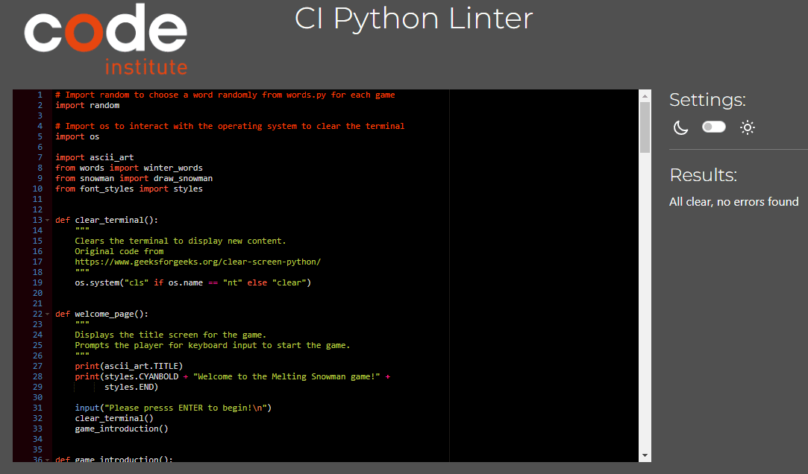
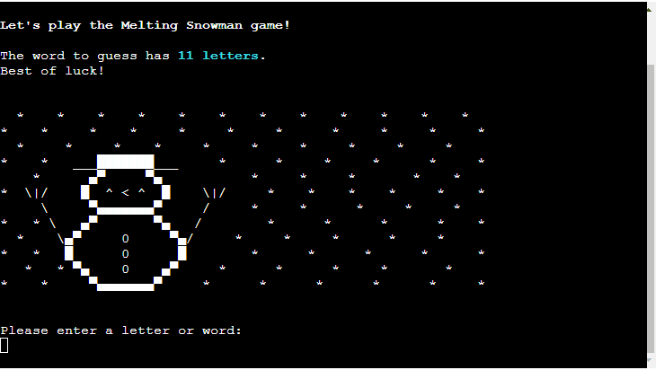
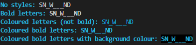

# Testing for Melting Snowman

Return to the main [README](https://github.com/ShizukaDonaghue/melting-snowman/blob/main/README.md)

## Code Validation
The application has been fully validated to ensure there were no syntax errors. [CI Python Linter](https://pep8ci.herokuapp.com/) was used for the validation and no errors were ound.

  
Validation Results for run.py

  

  
Validation Results for snowman.py

  

  
Validation Results for ascii_art.py

  

  
Validation Results for words.py

  

  
Validation Results for font_styles.py

  

## Manual Testing
Manual testing was conducted on the following elements in the game to verify that all the features functioned as expected and no issues were found.

### Welcome Screen
 | Step | Description        | Expected Result | Actual Result | Pass/Fail |
 |------|--------------------|-----------------|---------------|-----------|
 | 1    | Deployed website   | Welcome Screen loads without any issues | Welcome Screen loaded as expected  | Pass |
 |2 | The title of the game  | The title of the game is displayed with ASCII art | ASCII art loaded as expected | Pass |
| 3 | The font styles | The font styles are displayed correctly | The font styles displayed as expected | Pass |
 4 | Player input      | Once the player presses ENTER, the terminal is cleared and the Rules screen is displayed | The terminal is cleared and the Rules displayed as expected | Pass|

### Rules Screen
| Step | Description        | Expected Result | Actual Result | Pass/Fail |
|------|--------------------|-----------------|---------------|-----------|                
| 1 | Rules screen | Rules screen loads without any issues | Rules screen loaded as expected | pass |
| 2 | The title of the page | The title of the page is displayed with ASCII art | ASCII art loaded as expected | Pass |
| 3 | The font styles | The font styles are displayed correctly | The font styles displayed as expected | Pass |
| 4 | Player input | Only 6, 8, or 10 are accepted | Input validated as expected | Pass |
| 5 | Player input | If the input is invalid, displays an error message | Error message displayed as expected | Pass |
| 6 | Player input | Continues to request an input until a valid one is provided | Loop functioned as expected | Pass |
| 7 | Player input | Once the player enters a valid input, the terminal is cleared and the Game screen is displayed | The terminal cleared and the Game screen displayed as expected | Pass |

GIF image below showing the input validation. If the input from the player is invalid, the error message is displayed in yellow and the player is asked to select the number of lives until a valid input is provided.  
Please click on the image to watch the GIF as auto looping is turned off to minimise distraction.   

### Game Screen
| Step | Description        | Expected Result | Actual Result | Pass/Fail |
|------|--------------------|-----------------|---------------|-----------|  
| 1 | Game Screen | Game screen loads without any issues | Game screen loaded as expected | Pass |
| 2 | The font styles | The font styles are displayed correctly | The font styles displayed as expected | Pass |
| 3 | Number of letters in the word | In the first screen, the number of letters in the word is displayed | The number of letters displayed as expected | Pass |
| 4 | Initial snowman drawing | Snowman ASCII art is displayed based on the number of lives selected | Snowman displayed as expected | Pass | 
| 5 | Player input | If the input is not in the alphabet, displays an error message | Error message displayed as expeced | Pass |
| 6 | Player input | If the input contains the same number of letters as the word to be guessed, checks if the word has been tried already and if it is, gives feedback | If the input was already tried, gave an error message as expected | Pass |
| 7 | Player input | If the input contains the same number of letters as the word to be guessed and not tried already, checks if it is the correct word and gives feedback | Feedback on whether the word was correct displayed as expected | Pass |
| 8 | Player input | If the word suggested is correct, the game finishes and the player is brought to the correct End of Game screen with "Snowman Saved!" message. If not, the player loses a life and the word is stored to check for future tries unless they have no life left. If they have no life left, they are brought to the correct End of Game screen with "Game Over" message. | If the word was correct, the game finished and the correct End of Game screen displayed. If the word was incorrect, the player lost a life as expected | Pass |
| 9 | Snowman drawing | If the word was incorrect and the player loses a life but has more lives left, the snowman ASCII art changes based on the number of remaining lives | Snowman drawing changed as expected | Pass |
| 10 | Player input | If the input contains more than one letter, displays an error message | Error message displayed as expected | Pass |
| 11 | Player input | If the input contains one letter, checks if the input has been tried already and if it is, gives feedback | If the input was already tried, gave an error message as expected | Pass |
| 12 | Player input | If the input contains one letter and not tried already, checks if it is in the word to be guessed and gives feedback | Feedback on whether the input was in the word displayed as expected | Pass |
| 13 | Word to guess | If the input is in the word, displays the letter in the "Word to guess" field. If not, the player loses a life and the letter is stored to check for future tries unless they have no life left. If they have no life left, they are brought to the correct End of Game screen with "Game Over" message | If the letter was correct, the letter displayed in the field as expected. If not, the player lost a life as expected | Pass |
| 14 | Snowman drawing | If the letter is incorrect and the player loses a life but has more lives left, the snowman ASCII art changes based on the number of remaining lives | Snowman drawing changed as expected | Pass |
| 15 | The number of lives left | If the letter is incorrect, reduces the number of lives by one and displays the remaining number of lives if they have more left. If the player has no more lives left, the game finishes. | The number of lives displayed as expected unless the player had no lives left | Pass |
| 16 | Word to guess field | If the letter is correct and the word is not guessed yet, displays the letter instead of underscore(s) in the "Word to guess" field | Displayed the letter as expected | Pass |
| 17 | Letters tried | Letters tried are stored and displayed if there are more than one | Letters tried were displayed as expected | Pass |
| 18 | Loop | The game contines the same sequence until the word is guessed correctly or the player has no more lives left | Loop functioned as expected | Pass |
| 19 | Clear terminal | The terminal is cleared for each try | The terminal cleared as expected | Pass | 

GIF image below showing the input validation. If the input from the player is invalid, the error message is displayed in yellow and the player is asked to suggest a letter or word containing the same number of letters as the word to be guessed until a valid input is provided.  
Please click on the image to watch the GIF as auto looping is turned off to minimise distraction.  

### End of Game Screen
| Step | Description        | Expected Result | Actual Result | Pass/Fail |
|------|--------------------|-----------------|---------------|-----------|  
| 1 | End of Game Screen | End of Game screen loads without any issues | End of Game screen loaded as expected | Pass |
| 2 | The title of the page | The title of the page is displayed with ASCII art in both "Snowman Saved!" and "Game Over" screens | ASCII art loaded in both screens as expected | Pass |
| 3 | The font styles | The font styles are displayed correctly | The font styles displayed as expected | Pass |
| 4 | Correct word | The correct word is displayed and if the player has won, it is in green and if not, it is in yellow | The correct word displayed as expected | Pass |
| 5 | Play again | The play again message is displayed in both screens | The message is displayed in both screens as expected | Pass |
| 6 | Player input | Only Y or N is accepted | Input validated as expected | Pass |
| 7 | Player input | If the input is invalid, displays an error message | Error message displayed as expected | Pass |
| 8 | Player input | Continues to request an input until a valid one is provided | Loop functioned as expected | Pass |
| 9 | Player input | Once the player enters a valid input, the terminal is cleared and if Y is selected, the player is asked to select the number of lives to start another game, or the player is brought to the Welcome screen | The terminal cleared and the player was brought to the correct sreen as expected | Pass |

GIF image below showing the input validation. If the input from the player is invalid, the error message is displayed in yellow and the player is asked to select either "Y" or "N" until a valid input is provided.  
Please click on the image to watch the GIF as auto looping is turned off to minimise distraction.  

## User Stories Testing
User stories were tested and addressed as follows:

PLACE HOLDER FOR Implement basic manual testing procedures for code validation
Implement exception/error handling to optimise the user experience

PLACE HOLDER FOR Demonstrate, through screenshots, what the project outcomes are and how they have been met

## Resolved Bug
When font styles were added to `word_to_guess` variable, underscores for letters which were yet to be guessed did not print in the terminal of the deployed website. The issue was not seen in Gitpod. Various methods were tested and found that the underscores did not print in the deployed website if the font style was bold unless a background colour was added.

Image below showing how `word_to_guess` variable was printed in Gitpod. Underscores were printed in all font styles:  

Image below showing how `word_to_guess` variable was printed in the terminal of the deployed website using the same codes (but a different word as the word was randomly chosen). Underscores did not print if the font style was bold, or if it is bold, a background colour needed to be added for the underscores to print in the deployed website:  

Since coloured letters are difficult to read without bold font style in the terminal of the deployed website, font styles have been removed from the variable so that the underscores are printed clearly in white for the letters which are yet to be guessed.

## Unresolved Bug
`os.system("cls" if os.name == "nt" else "clear")` is used to clear the terminal for new contents during the game. However, this only clears the contents that are visible in the terminal of the deployed website and if there are any contents above that, they can still be seen when scrolled up after the terminal has been cleared. This issue is not seen in Gitpod. 

GIF image below showing the visible area of the terminal in the deployed website is cleared for new contents (in this case, the "game over" message), but the contents above the visible area can still be seen when scrolled up. Please click on the image to watch the GIF as auto looping is turned off to minimise distraction.   

Methods tried to fix this issue:
1. `import subprocess` `subprocess.call('reset')`  
    This is to clear history and it works as expected in Gitpod, however, it actually did not clear the terminal of the deployed website.
2. `print("\n" * 150)` 
    This does clear the terminal in Gitpod, but it still did not clear the terminal of the deployed website. This method was also tried with `os.system("cls" if os.name == "nt" else "clear")`, however, it still did not clear the contents above the visible area of the terminal in the deployed website. 

While this issue was not resolved, it should not affect the user experience during the game as the visible area of the terminal is cleared for new contents, which still provides a cleaner and more pleasant experience for the player.

Return to the main [README](https://github.com/ShizukaDonaghue/melting-snowman/blob/main/README.md)